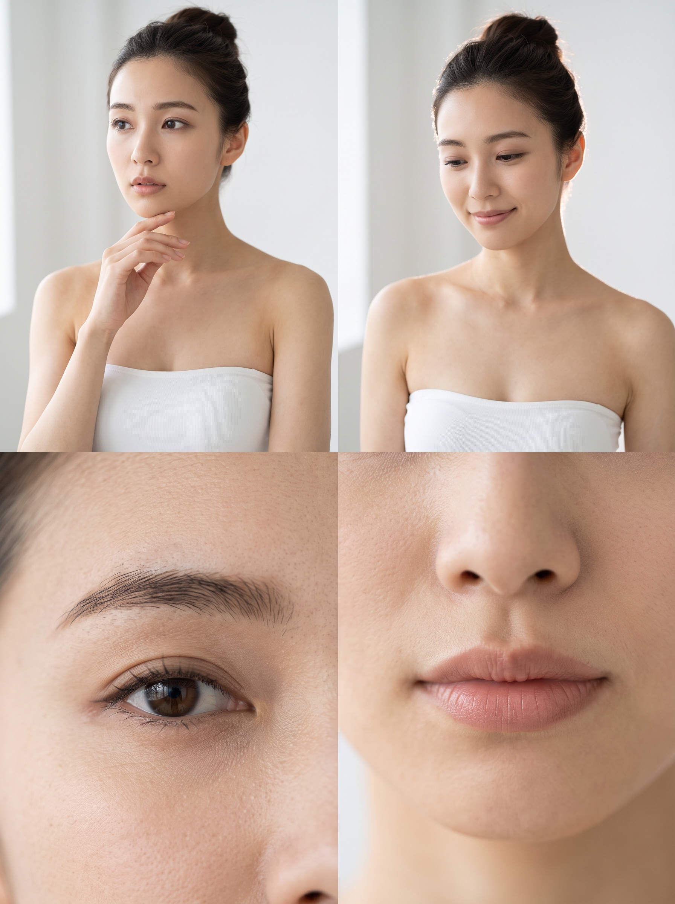
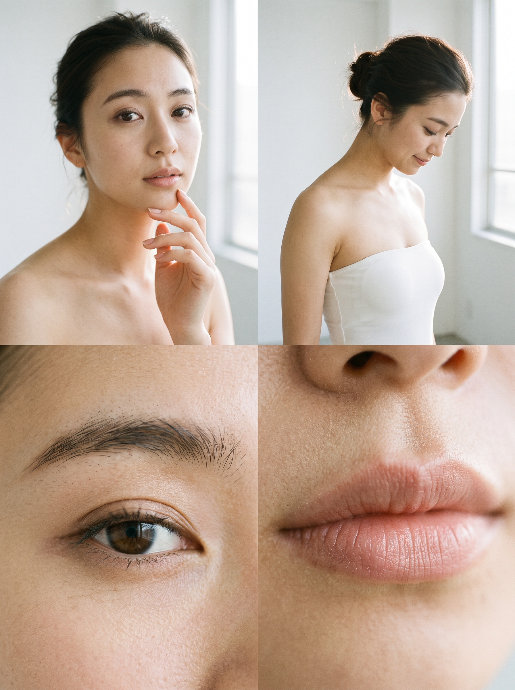
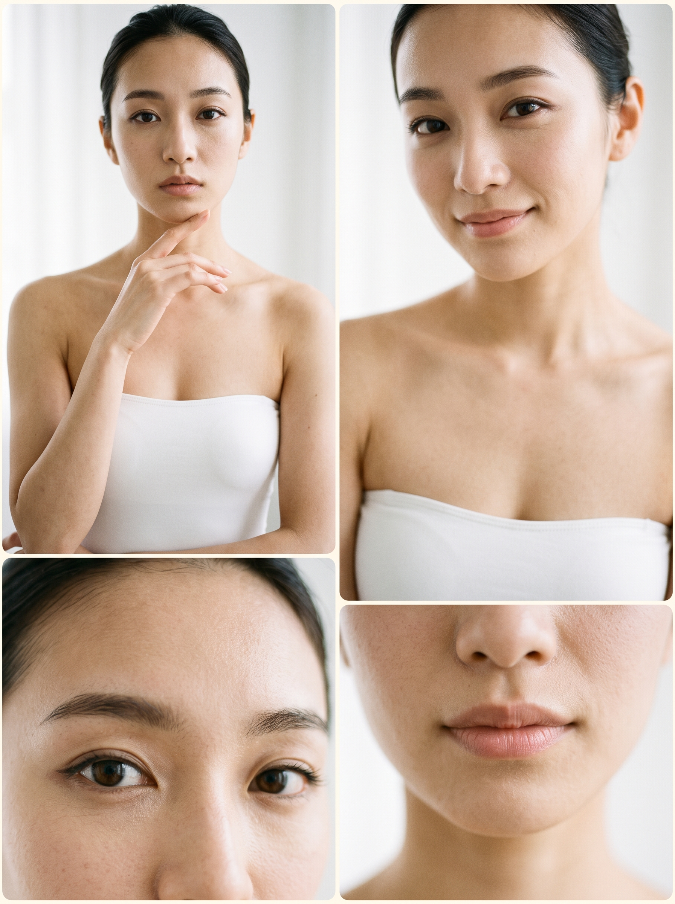
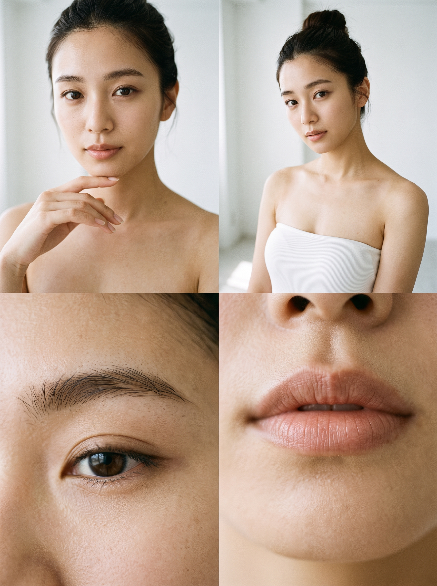
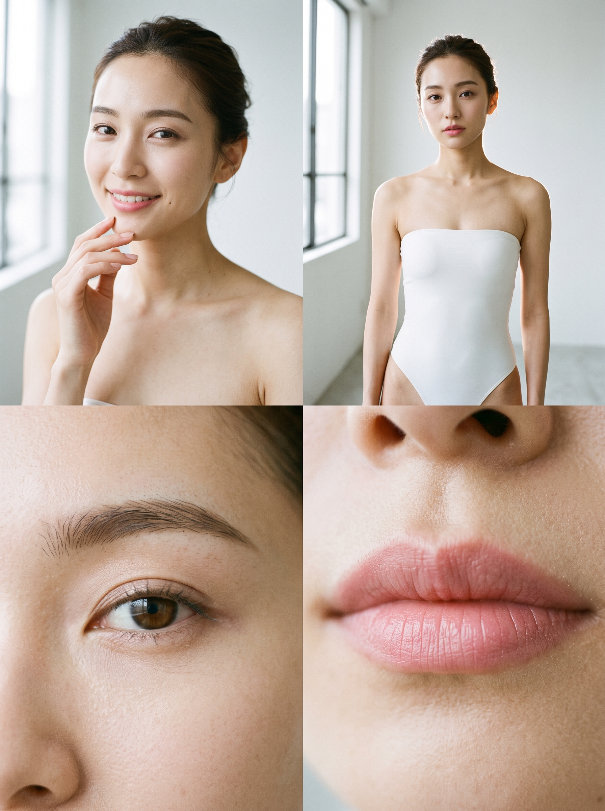
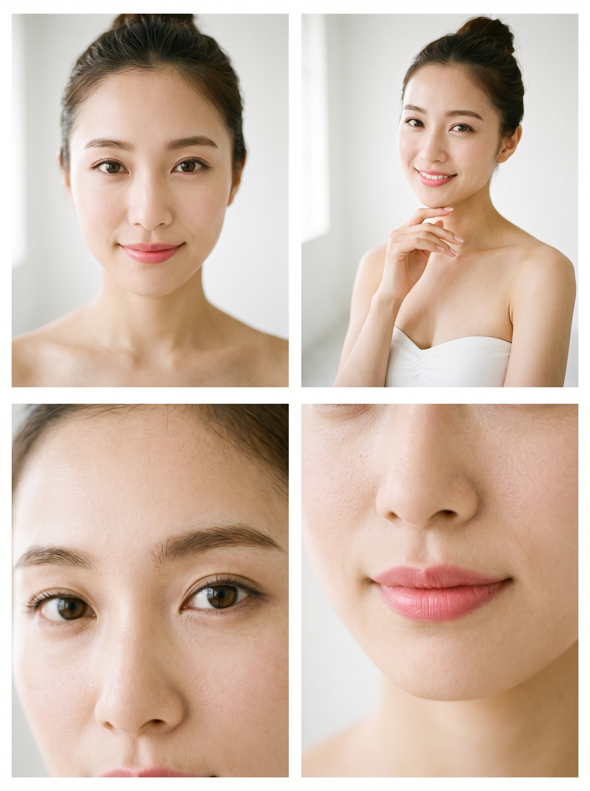
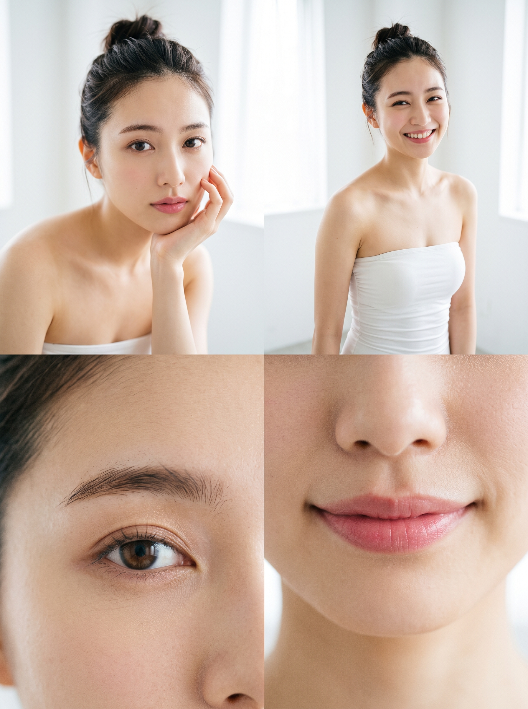
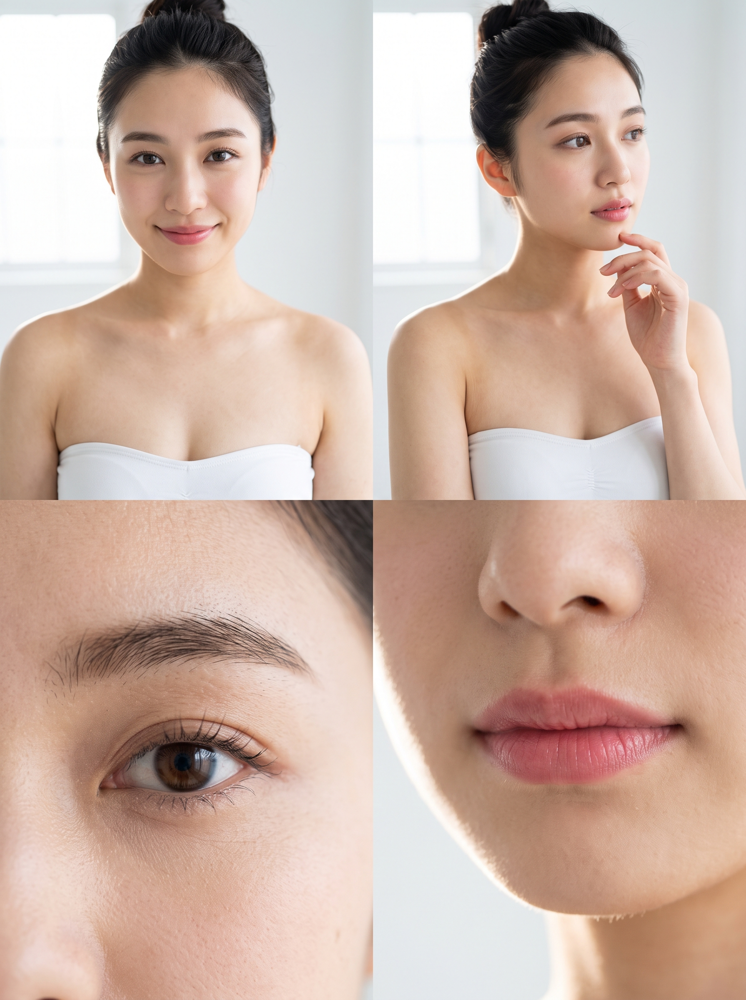

# Flow用プロンプトセンテンス辞書 メイクアップ編

---

## Makeup — プロンプト通過テスト

##### ■ナチュラル 
```
自然な肌感を生かした、薄く控えめなナチュラルメイク。
```
<table> <tr> <td width="25%"></td><td width="25%"></td><td width="25%"></td><td width="25%"></td> </tr> </table>

##### ■清楚
```
透明感のある肌に、淡いアイメイクと自然なピンクのリップを合わせた清楚なメイク。
```
<table> <tr> <td width="25%"></td><td width="25%"></td><td width="25%"></td><td width="25%"></td> </tr> </table>

---

##### ■上品
```
整った肌に、繊細なアイメイクと自然なリップを合わせた上品で洗練されたメイク。
```

##### ■フェミニン
```
柔らかなピンク系のアイメイクとチーク、自然なツヤのあるリップを使ったフェミニンなメイク。
```

##### ■華やか **有効**
```
明るく艶やかな肌に、はっきりとしたアイメイクと鮮やかなリップを合わせた華やかなメイク。
```

##### ■大人っぽい
```
落ち着いた色調で目元と唇をほどよく強調した、大人っぽいメイク。
```

##### ■クール
```
すっきりと整えた肌に、シャープなアイラインと控えめなリップを合わせたクールなメイク。
```

##### ■グラマラス
```
艶のある肌、強調されたまつ毛、立体的なアイメイク、深みのあるリップによるグラマラスなメイク。
```

##### ■レトロ
```
滑らかに整えた肌、くっきりしたアイライン、クラシックな赤いリップによるレトロなメイク。
```

##### ■キュート
```
丸みのある血色チークと、つやのあるピンクリップを合わせた、あどけなく可愛らしいメイク。
```

##### ■韓国風
```
均一に整えたつや肌に、グラデーションアイシャドウと直線的な眉、ぼかしたティントリップを合わせた韓国風メイク。
```

##### ■オフィス
```
清潔感のある肌に、控えめなブラウン系アイメイクとベージュ系リップを合わせた、きちんと感のあるオフィスメイク。
```

##### ■スモーキー
```
グレーやブラウンをぼかして陰影を強調したアイメイクに、深みのあるリップを合わせたスモーキーメイク。
```

##### ■サマー
```
日焼け風の肌に、オレンジ系のチークと軽やかなグロスリップを合わせた、爽やかな夏メイク。
```

##### ■エレガント
```
艶やかに整えた肌に、繊細なラメアイと深みのあるボルドー系リップを合わせた、エレガントで大人びたメイク。
```

##### ■セクシー
```
陰影をつけた立体的な目元と、艶のある赤系リップを強調した、大人の色気を感じるセクシーなメイク。
```

##### ■アンニュイ
```
くすみカラーのアイメイクと控えめな血色感のリップを合わせた、気だるく儚げな雰囲気のメイク。
```

##### ■ブライダル
```
透明感のある肌に、上品なパールアイシャドウと自然なピンクベージュのリップを合わせた、清らかなブライダルメイク。
```

##### ■ゴシック
```
白磁のような肌に、濃く縁取ったアイラインと深いワインレッドのリップを合わせた、耽美なゴシックメイク。
```

##### ■アイドル風
```
明るくハリのある肌に、丸みを帯びたアイメイクとぷっくりとしたコーラルリップを合わせた、元気で華やかなアイドル風メイク。
```

##### ■ツヤ肌
```
薄づきのベースに自然な光沢を加えた、みずみずしく潤いのあるツヤ肌メイク。
```

##### ■セミマット
```
肌の質感を均一に整え、自然な陰影を残した、上品なセミマットメイク。
```

##### ■血色感
```
自然な赤みのあるチークとリップで顔色を明るく見せた、健康的な血色感メイク。
```

##### ■ピンク
```
淡いピンクのアイシャドウとチーク、ピンク系のリップを合わせた、柔らかなピンクメイク。
```

##### ■モーヴ
```
くすみのあるモーヴ系のアイシャドウとチーク、落ち着いたモーヴリップを合わせた、大人っぽいメイク。
```

##### ■ブラウン
```
ベージュからブラウン系のアイシャドウと自然なブラウン系リップを使った、落ち着いたブラウンメイク。
```

##### ■ワントーン
```
アイメイク、チーク、リップを同系色で統一した、まとまりのあるワントーンメイク。
```

##### ■デカ目 **有効**
```
アイラインとまつ毛、涙袋を強調して、目を大きく印象的に見せるデカ目メイク。
```

##### ■中顔面短縮
```
目の下から頬の高い位置にチークを入れ、顔の縦幅を短く見せる中顔面短縮メイク。
```

##### ■コントゥア
```
鼻筋や頬、フェイスラインに自然な陰影を加えて、顔立ちを立体的に見せるコントゥアメイク。
```

##### ■涙袋強調
```
涙袋に明るい色と自然な影を加えて、目元の立体感を強調したメイク。
```

##### ■グロウ
```
肌の高い位置に自然な光を集め、内側から輝くようなツヤを演出したグロウメイク。
```

##### ■マット
```
肌の光沢を抑え、目元と唇も落ち着いた質感でまとめた、端正なマットメイク。
```

##### ■Y2K
```
ツヤのある肌に、明るいアイシャドウと光沢のあるリップを合わせた、2000年代風のY2Kメイク。
```

##### ■地雷系
```
明るく均一な肌に、赤みのある目元と強調した涙袋、赤系のリップを合わせた地雷系メイク。
```

##### ■量産型
```
明るい肌に、ピンク系のアイメイクとチーク、ツヤのあるピンクリップを合わせた甘く可愛らしい量産型メイク。
```

##### ■中華系
```
均一で立体感のある肌に、はっきりした眉と目元、深みのあるリップを合わせた中華系メイク。
```

##### ■韓国アイドル
```
透明感のあるツヤ肌に、立体的なアイメイクと涙袋、ツヤのあるリップを合わせた韓国アイドル風メイク。
```

---
