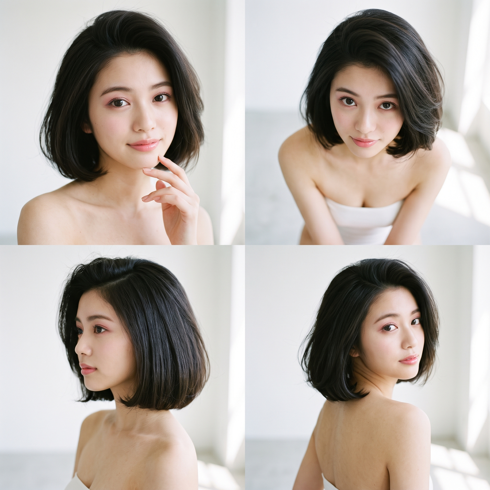
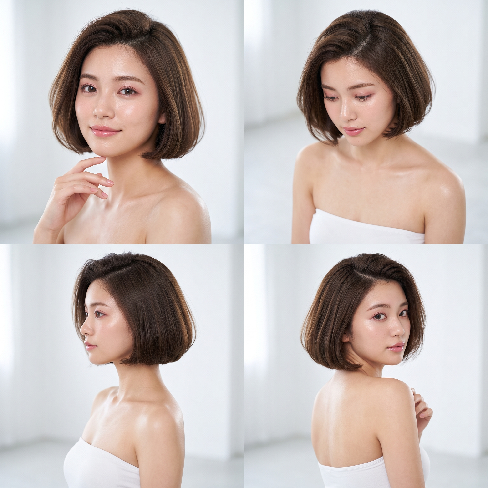
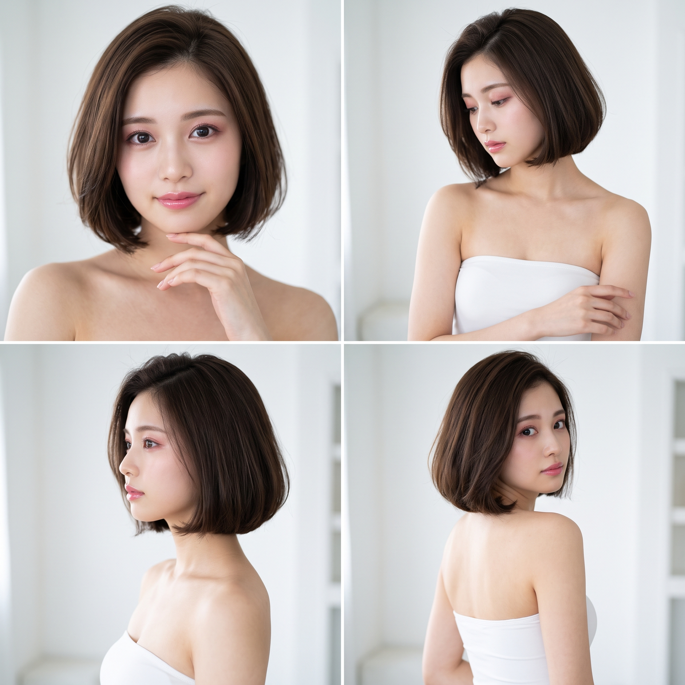
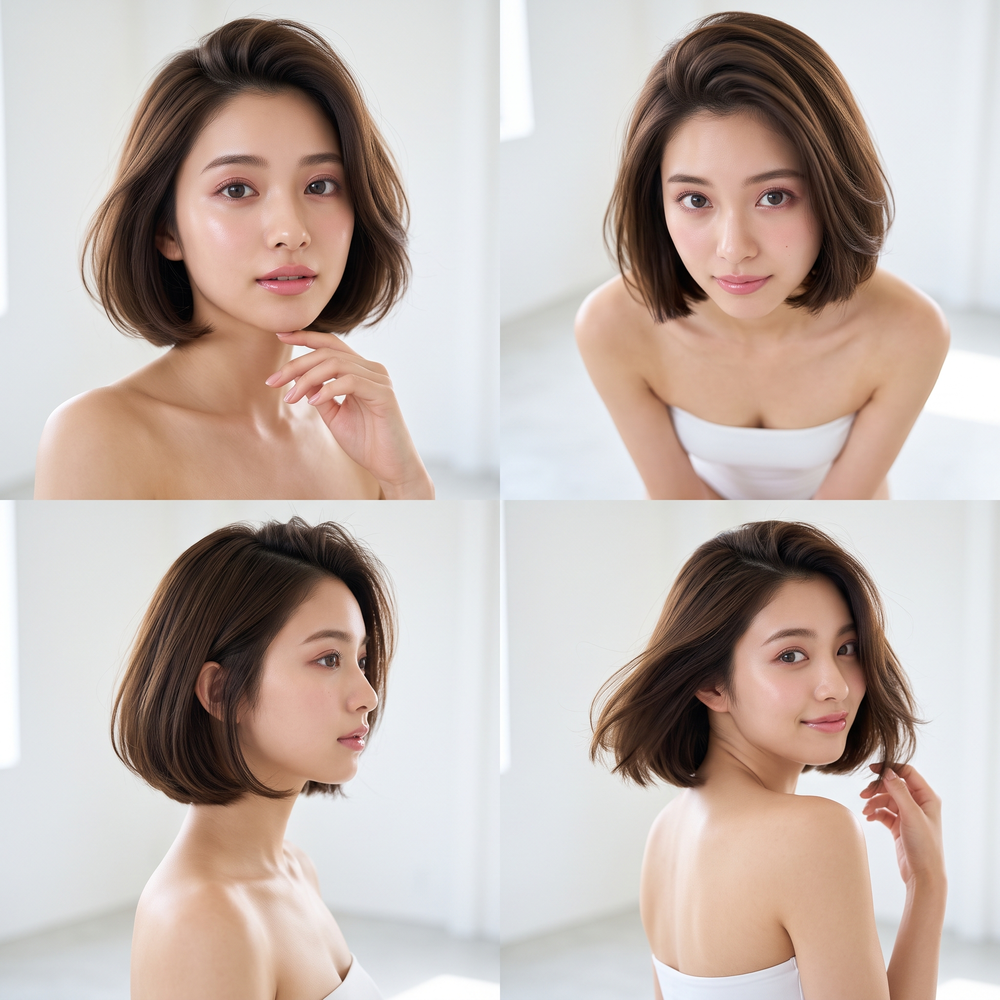
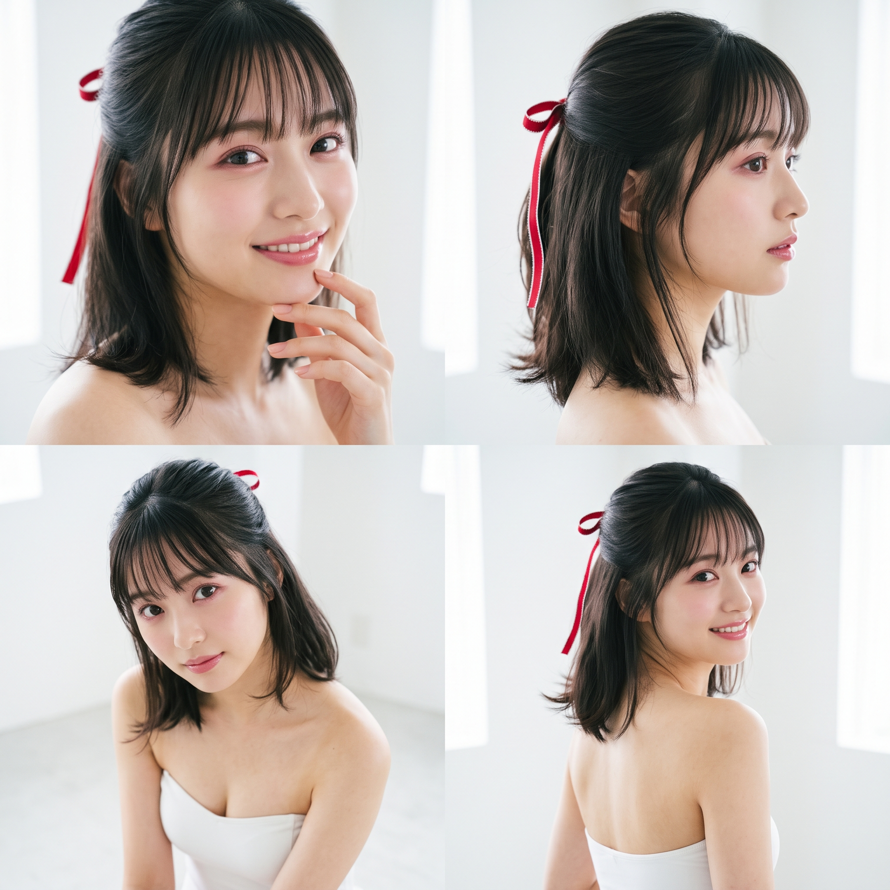
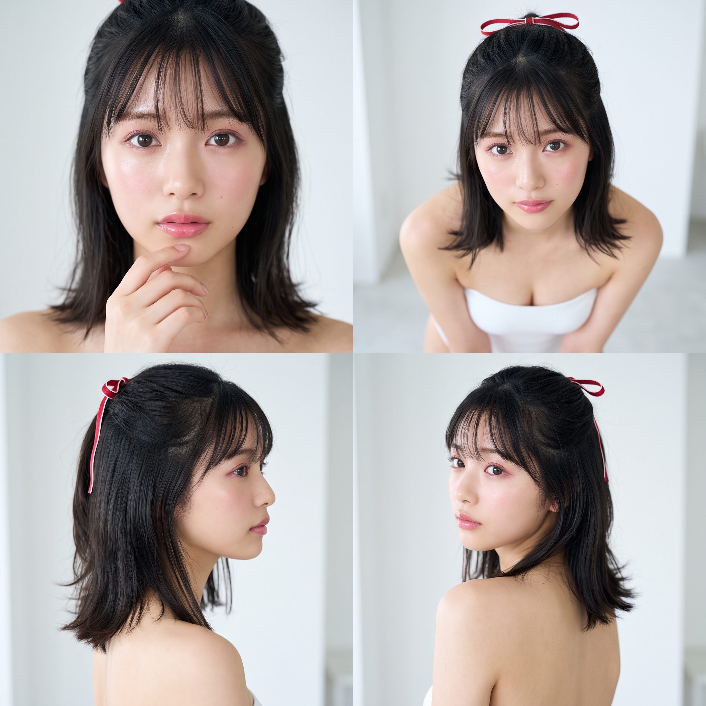
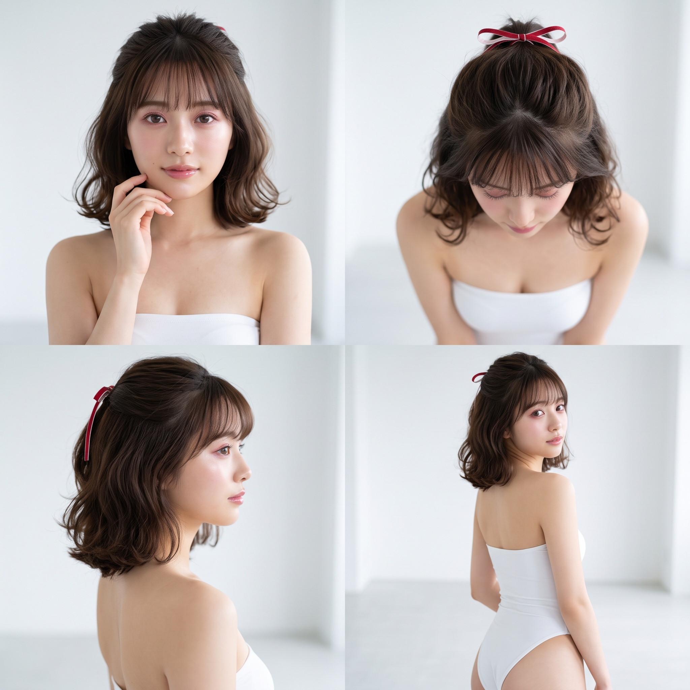
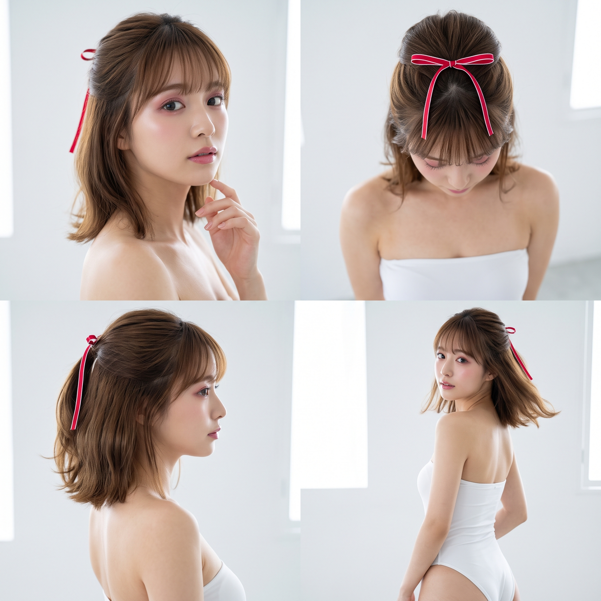

## [Google Flow] Sentence Prompt 髪型のメモ編

### 目的

とりあえず、試した**髪型のセンテンスプロンプトのプリセット**を置いとくところ。項目が「わかるやつだけわかればいい仕様」だったりと個人的嗜好強めですが、そこはまぁ。

---
### 髪型のメモ

#### ┣1997 ANABUKI 遠藤 型

<table>
<tr>
<td width="25%"></td><td width="25%"></td><td width="25%"></td><td width="25%"></td>
</tr>
</table>

```
サイドパートのナチュラルなレイヤーロング（ストレート〜微ウェーブ）。
```

#### ┣1997 ANABUKI 小林 型

<table>
<tr>
<td width="25%"></td><td width="25%"></td><td width="25%"></td><td width="25%"></td>
</tr>
</table>

```
シースルーバング、高めのハーフアップ、ゆるいナチュラルなウェーブストレートのロングヘア。
```

#### ┣1997 ANABUKI 大谷 型

<table>
<tr>
<td width="25%"></td><td width="25%"></td><td width="25%"></td><td width="25%"></td>
</tr>
</table>

```
セミロングヘアで薄い前髪とおでこ。
```

#### ┣1997 SHUWA 高木 型

<table>
<tr>
<td width="25%"></td><td width="25%"></td><td width="25%"></td><td width="25%"></td>
</tr>
</table>

```
シースルーバング、シュシュ付き高めハーフアップ、カールウェーブのロングヘア。
```

#### ┣1997 ECLIPSE 石黒 型

<table>
<tr width="75%">
<td width="25%"></td><td width="25%"></td><td width="25%"></td><td width="25%"></td>
</tr>
</table>

```
シースルーバング、セミロング〜ロングのストレートヘア。
```

#### ┣1992 WOWOW 杉浦 型

<table>
<tr>
<td width="25%"></td><td width="25%"></td><td width="25%"></td><td width="25%"></td>
</tr>
</table>

```
根元を立ち上げたサイドパートのボリューミーで毛先を顎から上でまっすぐ水平に揃えたワンレンボブ。
```

#### ┣1993 CABIN 杉浦 型

<table>
<tr>
<td width="25%"></td><td width="25%"></td><td width="25%"></td><td width="25%"></td>
</tr>
</table>

```
シースルーバング、白い縁がある鮮やかな赤の細く短めのリボン付きのハーフアップ、水平にボリュームがある肩くらいまでの長さの後ろ髪。
```
---

### 前髪

#### ┣シースルーバング
```
額が透けて見える、薄く軽いシースルーバング。
```

##### ├長さ
```
眉にかかる長さのシースルーバング。
```
```
目の上まで届く長さのシースルーバング。
```
```
目にかかる長さの長めのシースルーバング。
```

##### ├密度
```
毛量を少なくした、透け感の強いシースルーバング。
```
```
適度な毛量で額が自然に透けて見えるシースルーバング。
```

##### ├幅
```
中央部分を中心に作った、幅の狭いシースルーバング。
```
```
こめかみ付近まで広げた、幅の広いシースルーバング。
```

##### ├毛先
```
毛先を水平に揃えたシースルーバング。
```
```
毛先を軽く不揃いにしたシースルーバング。
```

##### └束感
```
細い毛束に分かれた、束感のあるシースルーバング。
```


#### ┣ぱっつん前髪
```
毛先をほぼ一直線に揃えた、ライン感のあるぱっつん前髪。
```

#### ┣斜め・流し前髪
```
前髪を斜めに流し、額が見えるようにした斜め・流し前髪。
```

#### ┣サイドバング
```
前髪の両端から自然につながり、顔まわりにかかるサイドバング。
```

#### ┣センターパート
```
前髪を中央で分け、左右に自然に流したセンターパート。
```

#### ┣ワイドバング
```
前髪の幅を広く取り、こめかみ付近まで広げたワイドバング。
```

#### ┣かきあげ前髪
```
前髪を根元から立ち上げ、後ろや横へ流したかきあげ前髪。
```

#### ┣ショートバング
```
眉より上の短い位置で切り揃えたショートバング。
```

#### ┣2wayバング
```
下ろして前髪ありにも、分けて前髪なしにもできる2wayバング。
```

---
